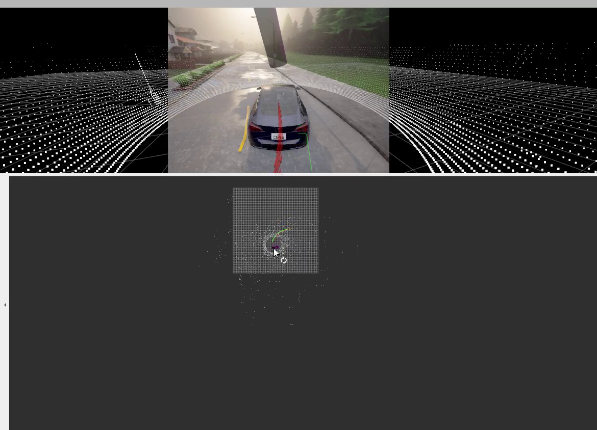

# Demo: Carla Simulation of automotive Dead Recking Based-on Error State Kalman Filter
In this demo, a Kalman filter is applied to track the pose of an automotive. IMU data and speed information[^1] are collected through Carla rosbridge. In the update step, the speed measurement is used to update the states. Moreover, non-holonomic constraints are applied.

[^1]: In practice, vehicle speed information can be obtained through on-board interface, visual odometry or even by binding an IMU on a non-steering wheel.

## Prerequisite
* Linux and ROS (has been test on Ubuntu 20.04 with ROS Noetic).
* [Carla Simulator](http://carla.readthedocs.io/en/latest/start_quickstart/) and [Carla rosbridge](https://carla.readthedocs.io/en/0.9.10/ros_installation/). Make sure your Python can find carla package, Python 3.7 is recommended.
## Build
* First, clone into you catkin workspace  
```bash
cd catkin_ws/src   
git clone https://github.com/LHengyi/ESKF-for-Automotive-Dead-Reckoning.git   
```
* Build  
```bash
catkin_make  
``` 
* To run   
```bash
roslaunch automotive_dead_reckoning carla_localization_ad_rosbridge.launch  
```
in another terminal  
```bash
roslaunch automotive_dead_reckoning wheel_ins.launch  
```
## Demonstration
<!-- [Demo video](http:youtube) -->
<a href="http://www.youtube.com/watch?feature=player_embedded&v=YOUTUBE_VIDEO_ID_HERE
" target="_blank"></a>
